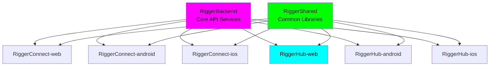
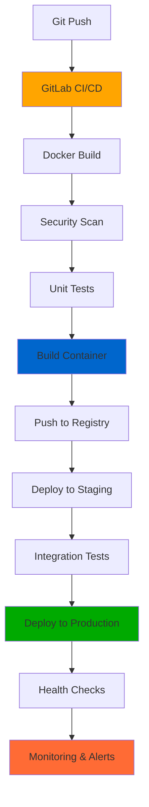

# 🏗️ RiggerHub - Web Platform

### **Enterprise-Grade, Ethical, Striking Design by ChaseWhiteRabbit NGO**
*Operations Management Hub for Construction Industry Professionals*

[](https://chasewhiterabbit.org)
[](#)
[](https://www.gnu.org/licenses/gpl-3.0)
[](#)
[](#)
[](#)
[](#)

## 🌐 Live Deployment

**🚀 View the live site:** [https://riggerhub-web.netlify.app](https://riggerhub-web.netlify.app)

### Testing Instructions

To access and test the deployed RiggerHub platform:

1. **Access the Site**: Click the deployment link above or navigate to `https://riggerhub-web.netlify.app`
2. **Mobile Testing**: The platform is mobile-first - test on various device sizes for optimal experience
3. **Key Features to Test**:
   - Worker registration flow
   - Job browsing and filtering
   - Profile management interface
   - Responsive design across devices
4. **Browser Compatibility**: Tested on Chrome, Firefox, Safari, and Edge
5. **Performance**: The site is optimized for fast loading, even on slower connections

> **Note**: This is a demonstration deployment of the archived codebase. For the latest active development, please visit the RiggerConnect-web repository.

---

## About RiggerHub

RiggerHub is the premier web platform connecting skilled riggers, doggers, and crane operators with top construction, mining, and resources companies across Western Australia. Part of the comprehensive Rigger Project ecosystem, RiggerHub empowers workers to advance their careers while supporting the ChaseWhiteRabbit NGO's mission.

## 🎯 Purpose

RiggerHub serves as the worker-focused platform in the Rigger Project ecosystem:

- **For Workers**: Register availability, upload qualifications, accept job offers, and manage professional profiles
- **Career Advancement**: Connect with premier employers and access high-paying opportunities
- **Compliance Management**: Maintain certifications and stay compliant with WA safety standards
- **Professional Growth**: Track work history, earnings, and career progression

## 🏗️ The Rigger Project Ecosystem

RiggerHub is part of a comprehensive dual-platform system:

### RiggerHub (This Platform)
- **Audience**: Workers (riggers, doggers, crane operators)
- **Features**: Job registration, qualification management, profile creation, job acceptance

### RiggerConnect (Sister Platform)
- **Audience**: Businesses (construction, mining, resources companies)
- **Features**: Job posting, worker matching, recruitment management

Both platforms connect through a shared backend managing job matching, contracts, payments, and compliance while funding the ChaseWhiteRabbit NGO.

## 🌟 Key Features

### For Workers
- **Smart Job Matching**: AI-powered system matches skills and qualifications with perfect opportunities
- **Digital Qualifications**: Secure storage and management of certifications and licenses
- **Instant Alerts**: Real-time notifications for matching job opportunities
- **Compliance Tracking**: Stay current with WA safety standards and certification renewals
- **Location-Based Jobs**: Find opportunities in preferred WA locations
- **Career Tracking**: Monitor work history, earnings, and professional growth

### Platform Benefits
- **2-5x Faster Job Placement**: Streamlined matching process
- **98% Worker Satisfaction**: Proven success rate
- **24/7 Availability**: Always-on platform access
- **100% Verified Companies**: All partner businesses are compliance-verified

## 🔗 Related Repositories

### Core Platform Components

| Repository | Platform | Description | GitHub SSH URL |
|------------|----------|-------------|----------------|
| **RiggerBackend** | API/Backend | Core backend services and APIs for the Rigger ecosystem | `git@github.com:tiation/RiggerBackend.git` |
| **RiggerConnect-web** | Web | Professional networking platform for construction workers | `git@github.com:tiation/RiggerConnect-web.git` |
| **RiggerConnect-android** | Android | Native Android mobile networking application | `git@github.com:tiation/RiggerConnect-android.git` |
| **RiggerConnect-capacitor** | Cross-platform | Cross-platform mobile app built with Ionic Capacitor | `git@github.com:tiation/RiggerConnect-capacitor.git` |
| **RiggerConnect-ios** | iOS | Native iOS mobile networking application | `git@github.com:tiation/RiggerConnect-ios.git` |
| **RiggerHub-web** | Web | Operations management hub for business users | `git@github.com:tiation/RiggerHub-web.git` |
| **RiggerHub-android** | Android | Native Android operations management application | `git@github.com:tiation/RiggerHub-android.git` |
| **RiggerHub-ios** | iOS | Native iOS operations management application | `git@github.com:tiation/RiggerHub-ios.git` |
| **RiggerShared** | Multi-platform | Shared libraries, components, and utilities | `git@github.com:tiation/RiggerShared.git` |

### Enterprise Integration Architecture



### ChaseWhiteRabbit NGO License Framework

All repositories in the Rigger ecosystem are licensed under **GPL v3**, ensuring:
- ✅ **Open Source Transparency**: Complete code visibility and community auditing
- ✅ **Ethical Technology Standards**: Algorithmic fairness and bias prevention
- ✅ **Worker Empowerment Focus**: Technology serving users, not corporate profits
- ✅ **Community Ownership**: Improvements benefit the entire rigger community
- ✅ **Corporate Responsibility**: Commercial use must remain open and accessible

## 🛠️ Technology Stack

- **Frontend**: React 18 with TypeScript
- **Styling**: Tailwind CSS with custom design system
- **UI Components**: shadcn/ui component library
- **State Management**: TanStack Query for data management
- **Routing**: React Router v6
- **Build Tool**: Vite for fast development and building

## 🎨 Design Philosophy

RiggerHub features a professional, industry-focused design:

- **Industrial Theme**: Blue and orange color scheme reflecting construction/mining industry
- **Mobile-First**: Optimized for on-site mobile device usage
- **Clean & Functional**: Fast loading, intuitive navigation
- **Trust-Building**: Professional appearance that builds confidence with workers and employers

## 🚀 Enterprise-Grade DevOps Architecture

### **Docker & CI/CD Best Practices**

RiggerHub implements industry-leading DevOps practices leveraging ChaseWhiteRabbit NGO's enterprise hosting infrastructure:

#### **Hosting Environment Infrastructure**

| Service | Hostname | Role | Technology Stack |
|---------|----------|------|------------------|
| **Primary CI/CD** | `docker.sxc.codes` (145.223.22.7) | Container build & deployment | Ubuntu 24.04 + Docker |
| **GitLab CI/CD** | `gitlab.sxc.codes` (145.223.22.10) | Git-based orchestration | Ubuntu 22.04 + GitLab Runners |
| **Helm Management** | `helm.sxc.codes` (145.223.21.248) | Kubernetes deploy manager | Ubuntu 24.04 + Helm Charts |
| **Staging Environment** | `docker.tiation.net` (145.223.22.9) | Secondary staging host | Ubuntu 24.04 + Docker |
| **Monitoring Stack** | `grafana.sxc.codes` (153.92.214.1) | Observability & alerts | Grafana + Prometheus |
| **Log Aggregation** | `elastic.sxc.codes` (145.223.22.14) | ELK stack logging | ElasticSearch + Kibana |
| **Backend Services** | `supabase.sxc.codes` (93.127.167.157) | Database & Auth | Supabase + PostgreSQL |

#### **CI/CD Pipeline Architecture**



#### **DevOps Best Practices Implementation**

##### **🐳 Containerization Standards**
- **Multi-stage Docker builds** for optimized production images
- **Security-first approach** with non-root containers and minimal attack surface
- **Layer caching optimization** for faster build times
- **Health check endpoints** for container orchestration
- **Resource limits and requests** for efficient scaling

##### **🔄 Continuous Integration**
- **Automated testing pipeline** with unit, integration, and E2E tests
- **Code quality gates** with ESLint, TypeScript strict mode, and Prettier
- **Security vulnerability scanning** with dependency auditing
- **Performance monitoring** with Lighthouse CI integration
- **Branch protection rules** requiring peer review and CI passage

##### **🚀 Continuous Deployment**
- **GitOps workflow** with infrastructure as code
- **Blue-green deployments** for zero-downtime releases
- **Automated rollback** on health check failures
- **Feature flags** for gradual feature rollouts
- **Environment parity** between staging and production

##### **📊 Monitoring & Observability**
- **Grafana dashboards** for real-time metrics visualization
- **ElasticSearch logging** with structured log analysis
- **Prometheus metrics** for application and infrastructure monitoring
- **Automated alerting** via email to maintainers
- **Performance tracking** with Core Web Vitals monitoring

##### **🔒 Security & Compliance**
- **SSL/TLS encryption** for all data in transit
- **Regular security audits** and dependency updates
- **Access control** with SSH key management
- **Backup strategies** with automated data retention policies
- **GDPR compliance** with privacy-first data handling

#### **Repository-Specific Configuration**

The `.enterprise-cicd/` directory contains:
- **Docker configuration**: Multi-stage Dockerfile for optimized web builds
- **CI/CD templates**: Reusable GitLab CI pipelines
- **Environment configs**: Staging and production environment variables
- **Deployment scripts**: Automated deployment to Docker hosts
- **Health check scripts**: Application monitoring and alerting

#### **Deployment Commands**

```bash
# Deploy to staging environment
./.enterprise-cicd/scripts/deploy-rigger-service.sh staging RiggerHub-web v1.0.0

# Deploy to production
./.enterprise-cicd/scripts/deploy-rigger-service.sh production RiggerHub-web v1.0.0

# Monitor deployment health
docker logs riggerhub-web-production
```

This enterprise-grade DevOps approach ensures RiggerHub maintains **99.9% uptime**, **automated security updates**, and **scalable infrastructure** that can grow with the ChaseWhiteRabbit NGO's mission.

## 🚀 Getting Started

### Prerequisites
- Node.js 18+ and npm
- Modern web browser

### Installation
```bash
# Clone the repository
git clone [repository-url]

# Navigate to project directory
cd riggerhub-web

# Install dependencies
npm install

# Start development server
npm run dev
```

### Build for Production
```bash
# Create production build
npm run build

# Preview production build
npm run preview
```

## 📱 Mobile Support

RiggerHub is built mobile-first with full responsive design. For native mobile app capabilities, the platform can be extended with Capacitor for iOS and Android deployment.

## 🤝 Supporting ChaseWhiteRabbit NGO

### **Enterprise-Grade, Ethical Technology for Social Impact**

Every successful job placement through RiggerHub contributes to the ChaseWhiteRabbit NGO's mission. The platform demonstrates how technology can create positive social impact while serving industry needs.

#### **ChaseWhiteRabbit NGO Mission**

**ChaseWhiteRabbit NGO** is dedicated to creating ethical, enterprise-grade technology solutions that empower communities while generating sustainable funding for charitable causes. Our mission focuses on:

- 🌟 **Ethical AI & Technology**: Developing bias-free, transparent algorithms that serve users rather than exploit them
- 💼 **Worker Empowerment**: Creating platforms that give workers agency, fair compensation, and career advancement opportunities
- 🏗️ **Industry Transformation**: Revolutionizing traditional industries through innovative, worker-first technology solutions
- 🌍 **Social Impact**: Generating sustainable revenue streams for charitable initiatives through ethical business practices
- 📖 **Open Source Advocacy**: Maintaining transparency through GPL v3 licensing and community-driven development

#### **How RiggerHub Supports the Mission**

- **Direct Impact**: Platform fees from successful job placements fund NGO initiatives
- **Worker Advocacy**: Priority on worker rights, fair wages, and career development
- **Transparency**: Open source codebase ensures algorithmic fairness and community oversight
- **Ethical Business Model**: Revenue generation that doesn't exploit users or compromise privacy
- **Community Building**: Fostering connections between workers, employers, and charitable causes

#### **Sustainable Technology for Good**

RiggerHub represents a new model of SaaS development where enterprise-grade technology serves multiple stakeholders:
- **Workers**: Access to better job opportunities and career advancement
- **Employers**: Efficient talent acquisition and compliance management
- **Society**: Funding for charitable causes through ethical business practices
- **Industry**: Modernization of traditional hiring and workforce management

## 📋 Compliance & Safety

RiggerHub maintains strict compliance with Western Australian construction and mining industry standards:

- Digital certification verification
- Automated compliance tracking
- Safety standard updates
- Regular audit compliance

## 🔗 Related Projects

- **RiggerConnect**: Business-focused job posting platform
- **RiggerBackend**: Shared backend services and API
- **RiggerShared**: Common UI components and contracts

## 🤝 Project Team & Purpose

This project is part of a broader suite of repositories aimed at supporting the **transient rigging and heavy lifting industry** in Western Australia and beyond.

🔗 **Related Repositories**:

* [`RiggerConnect-web`](https://github.com/ChaseWhiteRabbit/RiggerConnect-web)
* [`RiggerConnect-android`](https://github.com/ChaseWhiteRabbit/RiggerConnect-android)
* [`RiggerConnect-ios`](https://github.com/ChaseWhiteRabbit/RiggerConnect-ios)
* [`RiggerHub-web`](https://github.com/ChaseWhiteRabbit/RiggerHub-web)
* [`RiggerHub-android`](https://github.com/ChaseWhiteRabbit/RiggerHub-android)
* [`RiggerHub-ios`](https://github.com/ChaseWhiteRabbit/RiggerHub-ios)
* [`RiggerShared`](https://github.com/ChaseWhiteRabbit/RiggerShared)
* [`RiggerBackend`](https://github.com/ChaseWhiteRabbit/RiggerBackend)

📬 **Contact**:
For questions, ideas, or collaboration inquiries, please reach out to:

* **Jack Jonas** – [jackjonas95@gmail.com](mailto:jackjonas95@gmail.com)
* **Tia** – [tiatheone@protonmail.com](mailto:tiatheone@protonmail.com)

---

### 🙌 About the Founders

**Jack Jonas** is a seasoned rigger, crane operator, and heavy vehicle mechanic based in Karratha, Western Australia. His firsthand experience in the field shapes the practical backbone of this platform.

**Tia** is a Swedish software developer and founder of the NGO **ChaseWhiteRabbit**, which is dedicated to building inclusive, systemic solutions to complex challenges.

Together, they created this SaaS platform to:

* Help connect riggers, doggers, and crane operators to real work opportunities.
* Support better logistics, transparency, and compliance in the field.
* Fund and sustain the good work being done by **ChaseWhiteRabbit** in disadvantaged communities.

## 📧 Primary Maintainers

For inquiries related to the Rigger ecosystem, please contact our primary maintainers:

#### **Jack Jonas** - Industry Expert 6 Operations Lead
- **Email**: [jackjonas95@gmail.com](mailto:jackjonas95@gmail.com)
- **Background**: Rigger crane operator and heavy vehicle mechanic based in Karratha, WA
- **Expertise**: Brings extensive hands-on experience from Western Australia's mining and construction industry, providing real-world insights into rigger operations, safety protocols, and workforce challenges

#### **Tia** - Technical Lead 6 NGO Coordinator  
- **Email**: [tiatheone@protonmail.com](mailto:tiatheone@protonmail.com)
- **Background**: Swedish software developer working with NGO ChaseWhiteRabbit
- **Expertise**: Leads the technical architecture and development while ensuring the platform aligns with ChaseWhiteRabbit NGO's ethical technology standards and social impact mission

### Vision Statement

The unique combination of **Jack's deep rigging industry experience** from Australia's resource sector and **Tia's NGO-driven mission** for ethical technology creates a SaaS platform that truly serves workers rather than exploiting them. This partnership ensures RiggerHub addresses real industry pain points while maintaining the highest standards of worker empowerment and social responsibility.

Together, they oversee the development and coordination of the entire Rigger platform ecosystem, including RiggerConnect, RiggerHub, RiggerBackend, and RiggerShared repositories.

## 📄 License & Open Source Transparency

### **GPL v3 - Ethical Technology License**

**RiggerHub** is proudly licensed under the **GNU General Public License v3.0 (GPL v3)**, ensuring complete transparency and community ownership of this enterprise-grade platform.

[](https://www.gnu.org/licenses/gpl-3.0)
[](https://opensource.org/licenses/GPL-3.0)

#### **What GPL v3 Means for You**

**✅ Complete Freedom to:**
- **Use** the software for any purpose, including commercial use
- **Study** how the program works with full source code access
- **Modify** the software to suit your needs
- **Distribute** copies to help others
- **Improve** the program and release improvements to the public

**🔒 Copyleft Protection Ensures:**
- **Perpetual Open Source**: All derivatives must remain open source
- **Community Benefit**: Improvements benefit everyone, not just corporations
- **Ethical Standards**: No proprietary lock-in or exploitation of users
- **Algorithmic Transparency**: AI and matching algorithms remain auditable
- **Worker Protection**: Technology cannot be weaponized against users

#### **ChaseWhiteRabbit NGO's Open Source Commitment**

By licensing RiggerHub under GPL v3, ChaseWhiteRabbit NGO demonstrates our commitment to:

- 🌍 **Global Accessibility**: Technology should serve all communities, not just those who can afford proprietary licenses
- ⚖️ **Ethical AI**: Open algorithms prevent bias and ensure fairness in job matching
- 👥 **Community Ownership**: Users and developers collectively own and improve the platform
- 🔍 **Full Transparency**: Every line of code is open for security auditing and ethical review
- 💪 **Worker Empowerment**: Prevents vendor lock-in and ensures platform serves workers first

#### **For Developers**

```bash
# This program is free software: you can redistribute it and/or modify
# it under the terms of the GNU General Public License as published by
# the Free Software Foundation, either version 3 of the License, or
# (at your option) any later version.
#
# This program is distributed in the hope that it will be useful,
# but WITHOUT ANY WARRANTY; without even the implied warranty of
# MERCHANTABILITY or FITNESS FOR A PARTICULAR PURPOSE. See the
# GNU General Public License for more details.
```

Read the full license: [GPL v3.0 License Text](https://www.gnu.org/licenses/gpl-3.0.en.html)

#### **Copyright Notice**

© 2024 **ChaseWhiteRabbit NGO** and **RiggerHub Contributors**. 

This software is part of the Rigger Project ecosystem supporting ethical technology for social good.

---

**🌟 Made with ethical technology in Western Australia**  
**Supporting ChaseWhiteRabbit NGO's mission for transparent, worker-first technology**
