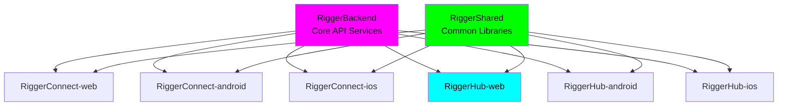

# 🗄️ ARCHIVED - RiggerHub - Web Platform

> **⚠️ This repository has been ARCHIVED. Please visit [RiggerConnect-web](https://github.com/tiation/RiggerConnect-web) for active development.**

## 🌐 Live Deployment

**🚀 View the live site:** [https://riggerhub-web.netlify.app](https://riggerhub-web.netlify.app)

### Testing Instructions

To access and test the deployed RiggerHub platform:

1. **Access the Site**: Click the deployment link above or navigate to `https://riggerhub-web.netlify.app`
2. **Mobile Testing**: The platform is mobile-first - test on various device sizes for optimal experience
3. **Key Features to Test**:
   - Worker registration flow
   - Job browsing and filtering
   - Profile management interface
   - Responsive design across devices
4. **Browser Compatibility**: Tested on Chrome, Firefox, Safari, and Edge
5. **Performance**: The site is optimized for fast loading, even on slower connections

> **Note**: This is a demonstration deployment of the archived codebase. For the latest active development, please visit the RiggerConnect-web repository.

---

## About RiggerHub

RiggerHub is the premier web platform connecting skilled riggers, doggers, and crane operators with top construction, mining, and resources companies across Western Australia. Part of the comprehensive Rigger Project ecosystem, RiggerHub empowers workers to advance their careers while supporting the ChaseWhiteRabbit NGO's mission.

## 🎯 Purpose

RiggerHub serves as the worker-focused platform in the Rigger Project ecosystem:

- **For Workers**: Register availability, upload qualifications, accept job offers, and manage professional profiles
- **Career Advancement**: Connect with premier employers and access high-paying opportunities
- **Compliance Management**: Maintain certifications and stay compliant with WA safety standards
- **Professional Growth**: Track work history, earnings, and career progression

## 🏗️ The Rigger Project Ecosystem

RiggerHub is part of a comprehensive dual-platform system:

### RiggerHub (This Platform)
- **Audience**: Workers (riggers, doggers, crane operators)
- **Features**: Job registration, qualification management, profile creation, job acceptance

### RiggerConnect (Sister Platform)
- **Audience**: Businesses (construction, mining, resources companies)
- **Features**: Job posting, worker matching, recruitment management

Both platforms connect through a shared backend managing job matching, contracts, payments, and compliance while funding the ChaseWhiteRabbit NGO.

## 🌟 Key Features

### For Workers
- **Smart Job Matching**: AI-powered system matches skills and qualifications with perfect opportunities
- **Digital Qualifications**: Secure storage and management of certifications and licenses
- **Instant Alerts**: Real-time notifications for matching job opportunities
- **Compliance Tracking**: Stay current with WA safety standards and certification renewals
- **Location-Based Jobs**: Find opportunities in preferred WA locations
- **Career Tracking**: Monitor work history, earnings, and professional growth

### Platform Benefits
- **2-5x Faster Job Placement**: Streamlined matching process
- **98% Worker Satisfaction**: Proven success rate
- **24/7 Availability**: Always-on platform access
- **100% Verified Companies**: All partner businesses are compliance-verified

## 🔗 Related Repositories

### Core Platform Components

| Repository | Platform | Description | GitHub SSH URL |
|------------|----------|-------------|----------------|
| **RiggerBackend** | API | Core backend services and APIs | `git@github.com:tiation/RiggerBackend.git` |
| **RiggerConnect-web** | Web | Professional networking platform | `git@github.com:tiation/RiggerConnect-web.git` |
| **RiggerConnect-android** | Android | Mobile networking app | `git@github.com:tiation/RiggerConnect-android.git` |
| **RiggerConnect-ios** | iOS | Mobile networking app | `git@github.com:tiation/RiggerConnect-ios.git` |
| **RiggerHub-android** | Android | Mobile operations hub | `git@github.com:tiation/RiggerHub-android.git` |
| **RiggerHub-ios** | iOS | Mobile operations hub | `git@github.com:tiation/RiggerHub-ios.git` |
| **RiggerShared** | Multi-platform | Shared libraries and components | `git@github.com:tiation/RiggerShared.git` |

### Enterprise Integration Architecture



### ChaseWhiteRabbit NGO License Framework

All repositories in the Rigger ecosystem are licensed under **GPL v3**, ensuring:
- ✅ **Open Source Transparency**: Complete code visibility and community auditing
- ✅ **Ethical Technology Standards**: Algorithmic fairness and bias prevention
- ✅ **Worker Empowerment Focus**: Technology serving users, not corporate profits
- ✅ **Community Ownership**: Improvements benefit the entire rigger community
- ✅ **Corporate Responsibility**: Commercial use must remain open and accessible

## 🛠️ Technology Stack

- **Frontend**: React 18 with TypeScript
- **Styling**: Tailwind CSS with custom design system
- **UI Components**: shadcn/ui component library
- **State Management**: TanStack Query for data management
- **Routing**: React Router v6
- **Build Tool**: Vite for fast development and building

## 🎨 Design Philosophy

RiggerHub features a professional, industry-focused design:

- **Industrial Theme**: Blue and orange color scheme reflecting construction/mining industry
- **Mobile-First**: Optimized for on-site mobile device usage
- **Clean & Functional**: Fast loading, intuitive navigation
- **Trust-Building**: Professional appearance that builds confidence with workers and employers

## 🚀 Getting Started

### Prerequisites
- Node.js 18+ and npm
- Modern web browser

### Installation
```bash
# Clone the repository
git clone [repository-url]

# Navigate to project directory
cd riggerhub-web

# Install dependencies
npm install

# Start development server
npm run dev
```

### Build for Production
```bash
# Create production build
npm run build

# Preview production build
npm run preview
```

## 📱 Mobile Support

RiggerHub is built mobile-first with full responsive design. For native mobile app capabilities, the platform can be extended with Capacitor for iOS and Android deployment.

## 🤝 Supporting ChaseWhiteRabbit NGO

Every successful job placement through RiggerHub contributes to the ChaseWhiteRabbit NGO's mission. The platform demonstrates how technology can create positive social impact while serving industry needs.

**ChaseWhiteRabbit NGO Mission**: [Add specific mission details]

## 📋 Compliance & Safety

RiggerHub maintains strict compliance with Western Australian construction and mining industry standards:

- Digital certification verification
- Automated compliance tracking
- Safety standard updates
- Regular audit compliance

## 🔗 Related Projects

- **RiggerConnect**: Business-focused job posting platform
- **RiggerBackend**: Shared backend services and API
- **RiggerShared**: Common UI components and contracts

## 📞 Support

For technical support or platform assistance:

- **Email**: support@riggerhub.com.au
- **Phone**: +61 8 9123 4567
- **Location**: Perth, Western Australia

### For Rigger Ecosystem inquiries, contact:
- **Primary Project Contacts**: jackjonas95@gmail.com, tiatheone@protonmail.com

## 📄 License

© 2024 RiggerHub. All rights reserved.

---

Made with ❤️ in Western Australia as part of the Rigger Project supporting ChaseWhiteRabbit NGO.